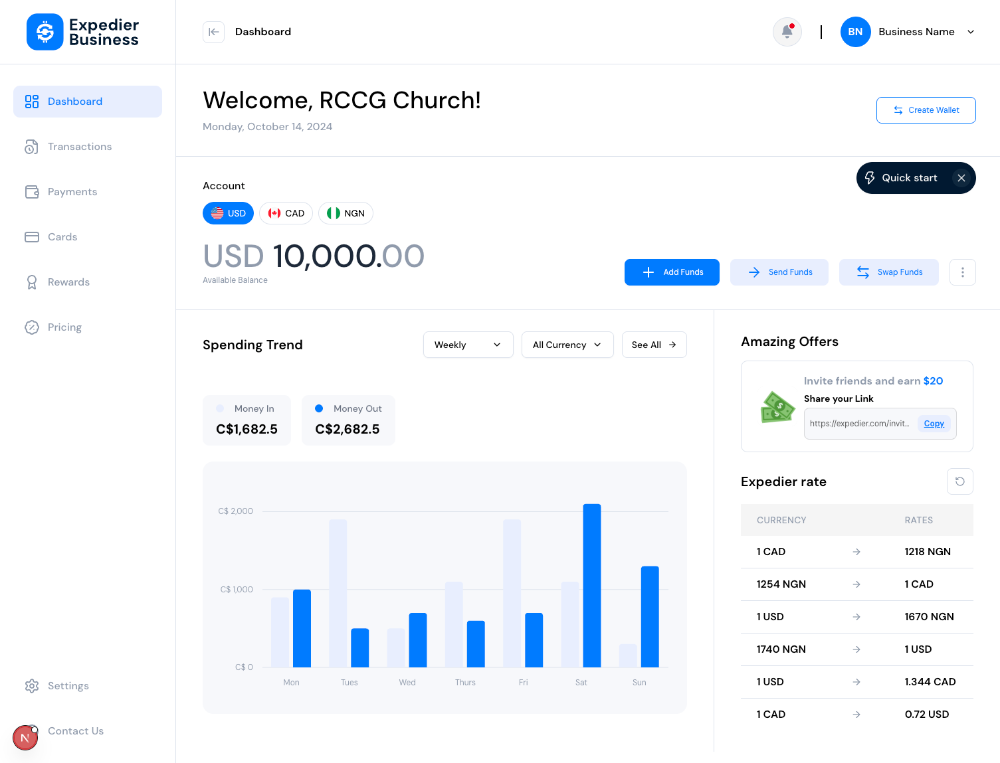
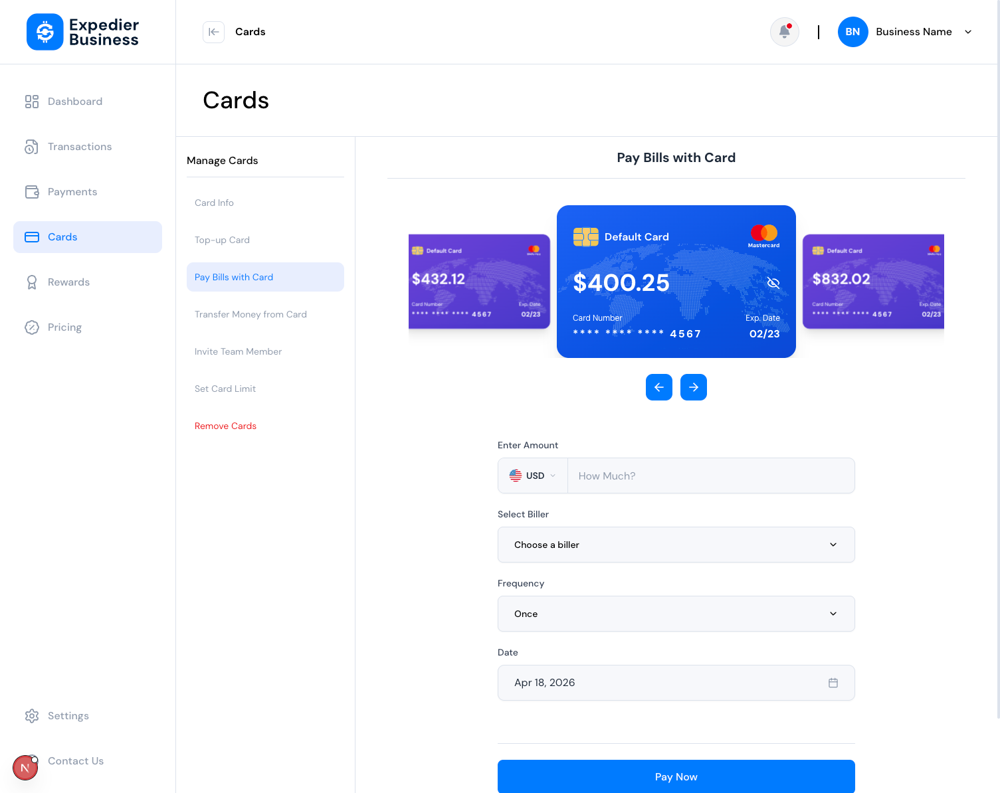
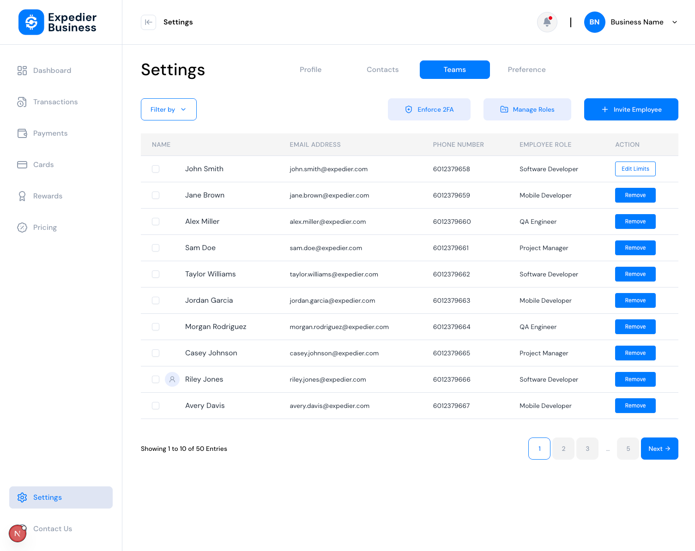
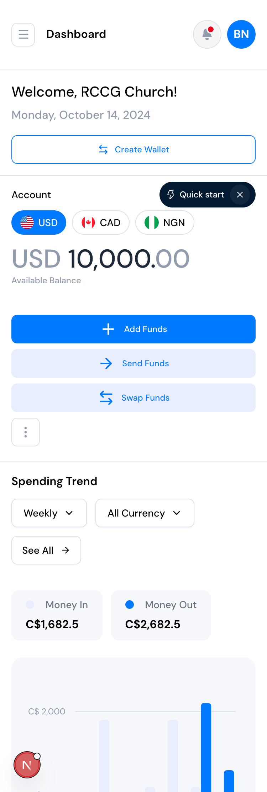
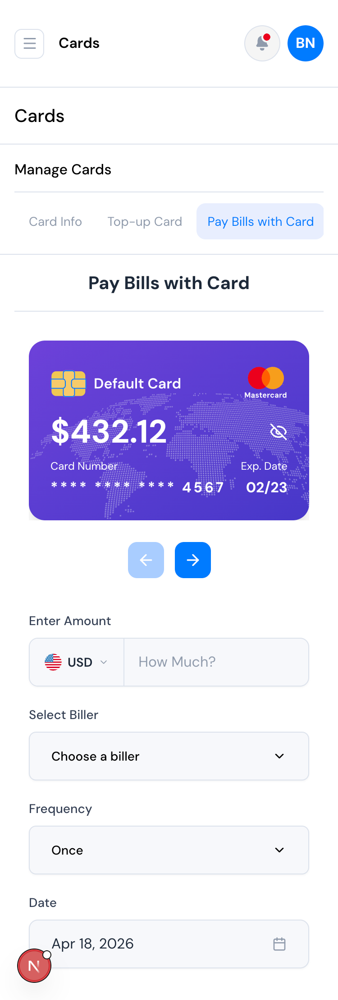
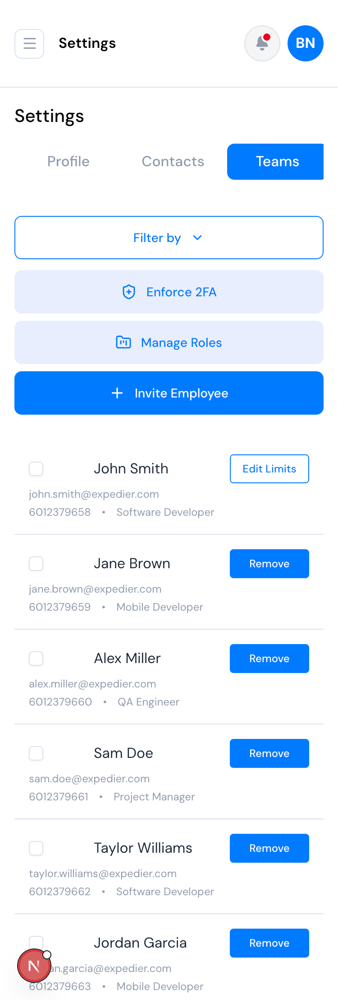

# Expedier Business — Frontend Assessment

A multi-currency business-wallet dashboard built as a frontend assessment. Next.js 16 (App Router + React 19), Tailwind v4, shadcn-style primitives, react-hook-form + zod, Recharts, Swiper, react-day-picker.

**Live demo:** https://expedier-business-assessment.vercel.app/

## Screenshots

### Desktop (1440×900)

| Dashboard | Cards — Pay Bills | Settings — Teams |
| --- | --- | --- |
|  |  |  |

### Mobile (375×812)

| Dashboard | Cards — Pay Bills | Settings — Teams |
| --- | --- | --- |
|  |  |  |

## Problem statement

Build a responsive fintech dashboard matching the provided Figma. Scope covers three primary surfaces:

1. **Dashboard** (`/dashboard`) — welcome banner, multi-currency balance with show/hide, three action CTAs, a Recharts spending-trend chart, referral offer with copy-link, and an exchange-rate table.
2. **Cards** (`/cards/*`) — sub-nav shell with sibling routes. The **Pay Bills with Card** sub-page contains a Swiper coverflow carousel and a zod-validated payment form (amount + currency + biller + frequency + date picker).
3. **Settings** (`/settings`) — tabbed settings area with a paginated **Teams** table, per-row actions, and empty-state tabs for Profile / Contacts / Preference.

Remaining routes (Transactions, Payments, Pricing, Rewards, Contact, most cards sub-pages) render a shared `ComingSoonPanel` behind the same chrome.

## Feature matrix

| Feature | Implemented | Notes |
| --- | --- | --- |
| Responsive layout (mobile drawer, collapsible desktop sidebar) | ✅ | `DashboardShell` wires mobile open + desktop collapsed state |
| Tooltip-on-collapse sidebar items | ✅ | Radix Tooltip scoped to collapsed state only |
| Hide/show card balance | ✅ | Eye toggle on the active credit card in `CardCarousel` |
| Currency switcher on balance | ✅ | USD / CAD / NGN tabs with active-state styling |
| Quickstart pill (dismissible) | ✅ | `QuickstartPill` |
| Spending-trend bar chart | ✅ | Recharts, custom Y-tick renderer, tooltip with branded colors |
| Copy referral link | ✅ | `navigator.clipboard` + `execCommand` fallback |
| Exchange-rates table | ✅ | shadcn Table primitives |
| Cards coverflow carousel | ✅ | Swiper + EffectCoverflow; middle-slide bigger; prev/next buttons |
| Pay-bills form with validation | ✅ | react-hook-form + zod; 5 fields; `Controller` for Radix selects + dropdown + calendar |
| Currency selector inside input addon | ✅ | Radix DropdownMenu + RadioGroup; wired to form schema |
| Date picker | ✅ | react-day-picker inside Radix Popover, tied to RHF via `Controller` |
| Teams table w/ pagination | ✅ | real `.slice()` over 50 mock members; range label updates |
| Per-row Edit Limits / Remove | ✅ | first row "Edit Limits", others "Remove" |
| Settings tabs (4) | ✅ | `Teams` populated; `Profile` / `Contacts` / `Preference` show `ComingSoonPanel` |
| SEO metadata | ✅ | Root + per-page `metadata`, JSON-LD, sitemap, robots, manifest |
| Loading skeletons | ✅ | root + per-segment `loading.tsx` |
| Global error boundary | ✅ | `src/app/error.tsx` with retry |
| Branded 404 | ✅ | `src/app/not-found.tsx` |
| PWA manifest | ✅ | `src/app/manifest.ts` |
| Unit tests | ✅ | Vitest + RTL + jsdom (see [Testing](#testing)) |

## Stack & key decisions

| Concern | Choice | Why |
| --- | --- | --- |
| Framework | Next.js 16 (App Router, RSC) | File-based routing, route groups, `metadata` API, layout-per-feature |
| UI | Tailwind v4 + CSS variables | Utility-first, theme-driven via tokens in `globals.css`, dark-ready |
| Primitives | shadcn-style `src/components/ui/*` over Radix | Accessible by default; the app **owns** the component code |
| Forms | `react-hook-form` + `zod` + `@hookform/resolvers/zod` | Type-inferred via `z.infer<>`, `Controller` for Radix selects, minimal re-renders |
| Charts | `recharts` | Grouped bar chart + `ResponsiveContainer` + custom Y tick to stop label wrapping |
| Carousel | `swiper` (`EffectCoverflow` module) | Centered-active "middle bigger" effect with touch, pointer, keyboard support |
| Date picker | `react-day-picker` + Radix Popover | Controlled by RHF via `Controller`, styled via Tailwind tokens |
| Icons | `lucide-react` + local SVG → component via `@svgr/webpack` | SVGR rule already in `next.config.ts` Turbopack rules |
| Fonts | `next/font` with `DM Sans` | Zero-CLS, no render-blocking |
| Testing | Vitest + React Testing Library + jsdom + `vite-plugin-svgr` | Fast, user-focused, mirrors the app's SVG pipeline |

## Project structure

```
src/
├── app/                                  # Next.js App Router
│   ├── (dashboard)/                      # Authenticated route group (shared chrome)
│   │   ├── dashboard/
│   │   │   ├── page.tsx                  # uses <DashboardView />
│   │   │   └── loading.tsx               # page-specific skeleton
│   │   ├── settings/
│   │   │   ├── page.tsx                  # uses <SettingsView />
│   │   │   └── loading.tsx
│   │   ├── cards/
│   │   │   ├── layout.tsx                # sub-nav shell + dynamic section title
│   │   │   ├── loading.tsx
│   │   │   ├── page.tsx                  # redirects → /cards/pay-bills
│   │   │   ├── pay-bills/page.tsx        # carousel + form
│   │   │   ├── info/ top-up/ transfer/ invite/ limit/ remove/  # ComingSoonPanel pages
│   │   ├── transactions/ payments/ pricing/ rewards/ contact/  # ComingSoonPanel pages
│   │   └── loading.tsx                   # fallback skeleton for the route group
│   ├── error.tsx                         # global error boundary w/ retry
│   ├── not-found.tsx                     # branded 404
│   ├── loading.tsx                       # root loading fallback
│   ├── opengraph-image.png               # static OG image
│   ├── layout.tsx                        # root metadata, fonts, JSON-LD
│   ├── page.tsx                          # redirect → /dashboard
│   ├── robots.ts                         # /robots.txt
│   ├── sitemap.ts                        # /sitemap.xml
│   ├── manifest.ts                       # PWA manifest
│   └── globals.css                       # Tailwind + design tokens
├── components/
│   ├── ui/                               # Primitives: button, input, label, select,
│   │                                     # checkbox, table, tooltip, popover, calendar,
│   │                                     # dropdown-menu, form, skeleton, badge, card
│   ├── molecules/                        # ComingSoonPanel
│   ├── organisms/                        # Sidebar, Topbar, DashboardShell
│   └── seo/                              # JSON-LD helpers (Organization, WebSite)
├── features/                             # Feature-scoped: components + hooks + types
│   ├── dashboard/                        # BalanceSection, SpendingTrendCard+Chart,
│   │                                     # AmazingOffersCard, ExchangeRatesCard, QuickstartPill
│   ├── cards/                            # CardCarousel, CardSubNav, PayBillsForm
│   └── settings/                         # SettingsView, SettingsTabs, TeamsToolbar, TeamsTable
├── mocks/                                # Typed sample data (cards, team, rates, spending)
├── constants/                            # site config, navigation
├── assets/icons/                         # SVGs imported as React components via SVGR
└── lib/                                  # utils (cn, formatters)
public/
├── images/                               # Large static SVGs (served as URL, not bundled)
│   └── map.svg                           # Credit-card world-map background
└── screenshots/                          # README screenshots
tests/                                    # Vitest + RTL suites (+ setup.ts)
```

## Getting started

Prereqs: **Node 20+**, npm.

```bash
# install
npm install

# dev server — http://localhost:3000
npm run dev

# production build + serve
npm run build
npm start
```

### Environment variables

Copy [`.env.example`](./.env.example) to `.env.local` and fill in:

```bash
NEXT_PUBLIC_SITE_URL=https://your-deployment.vercel.app
```

`NEXT_PUBLIC_SITE_URL` powers canonical URLs, `<link rel="canonical">`, sitemap entries, OpenGraph URLs and JSON-LD `@id` / `url` fields. Without it, the site falls back to the placeholder in [`src/constants/site.ts`](./src/constants/site.ts).

## Scripts reference

| Script | Purpose |
| --- | --- |
| `npm run dev` | Start Next dev server on :3000 (Turbopack) |
| `npm run build` | Production build |
| `npm start` | Serve the production build |
| `npm run lint` | ESLint (`eslint-config-next`) |
| `npm test` | Vitest in watch mode |
| `npm run test:run` | One-shot test run (CI) |
| `npm run test:coverage` | Test run with v8 coverage |

## Testing

Vitest + React Testing Library + jsdom. Test suites cover the primary user-facing behaviour across the app:

- **`ComingSoonPanel`** — default + overridden description, label rendering.
- **`QuickstartPill`** — mounts then disappears on dismiss.
- **`BalanceSection`** — greeting / date / amount render, currency tab switching, CTA presence.
- **`AmazingOffersCard`** — copy-link content + "Copied" confirmation.
- **`PayBillsForm`** — zod-driven validation: empty-required, non-positive amount, reset on Cancel, partial-fill error surfacing.
- **`SettingsView`** — heading + 4 tabs, Teams default active, tab switch swaps in ComingSoonPanel.
- **`TeamsTable`** — columns, Edit Limits vs Remove, checkbox selection, pagination summary, **advance-to-next-page** updates the range label.
- **`DashboardView`** — top-level regions + exchange-rate rows render end-to-end.
- **`CardCarousel`** — slide count per data row, formatted balances, prev/next buttons present.

A focused `tests/setup.ts` supplies browser APIs jsdom doesn't ship (`ResizeObserver`, `IntersectionObserver`, `matchMedia`, `Element.hasPointerCapture`, `navigator.clipboard`) and mocks `next/image` + `next/navigation` so tests stay hermetic.

## SEO

| Artifact | File |
| --- | --- |
| Global metadata (title template, description, OG, Twitter, robots, icons, manifest) | [`src/app/layout.tsx`](./src/app/layout.tsx) |
| Per-page `metadata` + canonical + OG overrides | each `page.tsx` under `src/app/(dashboard)/` |
| `robots.txt` | [`src/app/robots.ts`](./src/app/robots.ts) |
| `sitemap.xml` (derived from nav constants) | [`src/app/sitemap.ts`](./src/app/sitemap.ts) |
| PWA manifest | [`src/app/manifest.ts`](./src/app/manifest.ts) |
| OpenGraph image | [`src/app/opengraph-image.png`](./src/app/opengraph-image.png) |
| JSON-LD `Organization` + `WebSite` | [`src/components/seo/JsonLd.tsx`](./src/components/seo/JsonLd.tsx) |
| Viewport theme-colors for light/dark | `layout.tsx` `export const viewport` |

Authenticated-feel pages (`/settings`, `/cards/*`) are explicitly marked `robots: { index: false, follow: true }`. Marketing-like pages (`/pricing`, `/contact`) allow indexing.

## Accessibility

- **Semantic roles**: `role="tablist"`, `role="tab"`, `role="alert"`, `role="status"`, `role="dialog"` (via Radix), labelled `<table>` / `<form>`.
- **Every icon-only button has an `aria-label`.** Verified via `npm run lint` (`jsx-a11y` ruleset in `eslint-config-next`).
- **Form fields**: visible labels (`<Label htmlFor>`), `aria-invalid`, `aria-describedby` pointing at `role="alert"` error nodes with stable `useId()` IDs.
- **Mobile sidebar drawer**: locks body scroll when open; closes via backdrop click, `Esc`, or activating a link. Collapsed-desktop sidebar exposes link labels as Radix tooltips.
- **`aria-live="polite"`** on the copy-link confirmation so screen readers announce "Copied".
- **Reduced motion**: only the skeleton pulse runs continuously; Swiper, Popover, etc. respect user's prefers-reduced-motion via Radix / Swiper defaults.
- **Keyboard navigation**: all interactive primitives are Radix-backed — arrow keys, Esc, Enter/Space all wired out of the box.

## Performance

- **Large decorative SVG served as a static asset**: `public/images/map.svg` is painted as `background-image` on the credit-card face so the JS bundle stays lean (avoids SVGR/Babel pulling a huge SVG into the client graph).
- **`next/font`** — `DM Sans` self-hosted via `next/font/google`, `variable` on `<html>`, no render-blocking stylesheet request.
- **Route-based code splitting** — every page is its own RSC bundle; `"use client"` scoped as narrowly as possible (feature shells + forms only).
- **No runtime CSS-in-JS** — Tailwind v4 + tokens compile to static CSS.
- **Dashboard + Swiper**: main column uses `min-w-0` / horizontal clip so `slidesPerView="auto"` does not inflate flex intrinsic width or shift the sidebar layout on large screens.
- **Vitest**: `server.deps.inline` for `swiper` and `recharts` only in tests—keeps production bundling unchanged while stabilizing jsdom runs.

## Design trade-offs

- **Route group `(dashboard)`** for shared sidebar/topbar chrome instead of a top-level page component — keeps `src/app/` flat and preserves per-route `metadata`.
- **Feature-first inside `src/features/*`** (components + hooks + types colocated). `src/components/` holds only truly app-wide primitives.
- **Atomic-design-ish** folder naming (`atoms` → `ui/`, `molecules`, `organisms`, `templates` → layouts). Not pedantically enforced.
- **shadcn-style ownership** — every `src/components/ui/*` file is editable app code, not a black-box package.
- **Zod as single source of truth for form types** — `type PayBillsValues = z.infer<typeof payBillsSchema>` avoids drift between runtime validation and TS shapes.
- **Mock data isolated in `src/mocks/`** — cards, team, rates, spending. Features import these, so wiring a real API later is a one-line change per feature.
- **Map image served from `/public`** instead of inlined — see Performance.
- **Tests favour user-visible behaviour** (`getByRole`, `getByLabelText`) over implementation details.
- **Dark-mode-ready tokens** — every color is driven by CSS variables so a theme toggle drops in with a single class flip.

## Deployment

Deployed to Vercel at https://expedier-business-assessment.vercel.app/.

To redeploy from scratch:

1. Push to GitHub.
2. Import the repo in Vercel.
3. Set `NEXT_PUBLIC_SITE_URL` to your deployment URL in Vercel → Project → Settings → Environment Variables.
4. Deploy. No extra build-time configuration needed.

## Roadmap

Natural next steps if this moved beyond a demo:

- **Data layer** — swap `src/mocks/*` for `@tanstack/react-query` + typed fetchers at a single seam.
- **Auth + route guards** — wrap the `(dashboard)` route group.
- **Dark-mode toggle** — tokens already support it; plug in `next-themes`.
- **Storybook** for `components/ui/*` as a live component catalogue.
- **Playwright E2E** for multi-step flows.

## License

Assessment submission — not licensed for redistribution.
